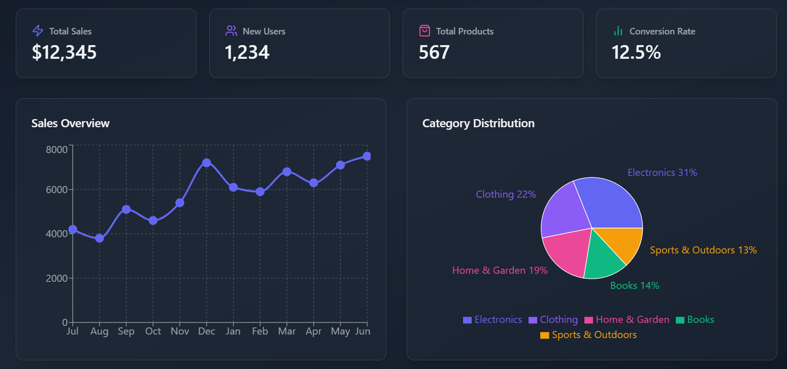
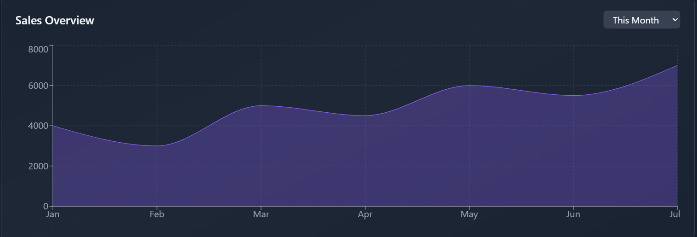
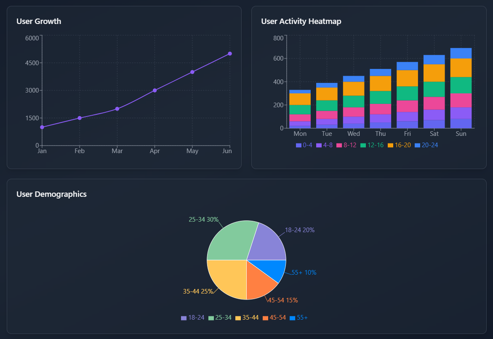

# 📊 Data Visualization Dashboard with Recharts

This is a React-based data visualization dashboard that presents user analytics using **Recharts**. The dashboard includes interactive graphs, heatmaps, and pie charts for better insights.

## 🚀 Features
- 📈 **User Growth Line Chart**
- 🔥 **User Activity Heatmap**
- 🏆 **User Demographics Pie Chart**
- 🎨 **Dark Theme for Better Visualization**
- ⚡ Built with **Vite** for Fast Performance


Here are some previews of the dashboard:

### 1️⃣ User Growth Chart


### 2️⃣ User Activity Heatmap


### 3️⃣ User Demographics Chart


## 🛠️ Installation & Setup

Follow these steps to run the project locally:

```sh
git clone https://github.com/aamir9185/data--visualiser.git
cd data--visualiser
npm install
npm run dev
